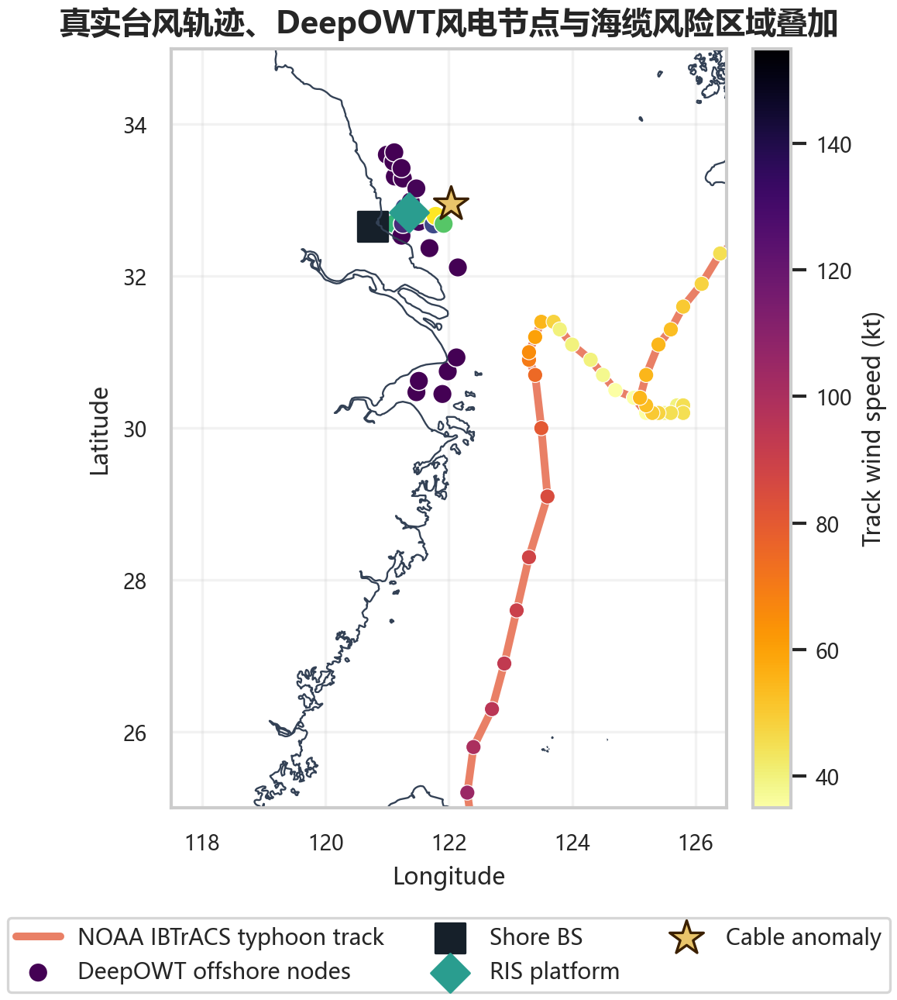
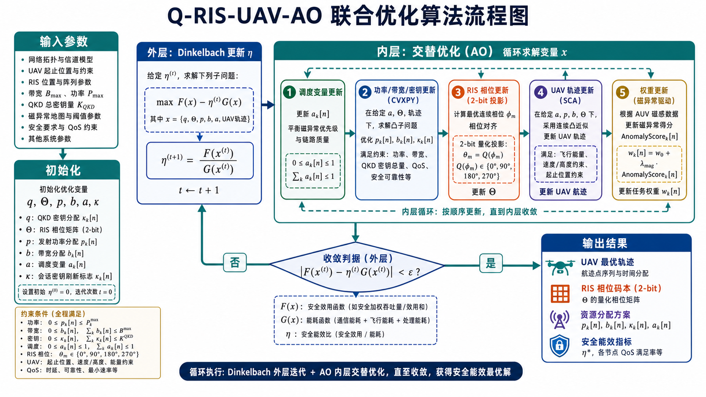
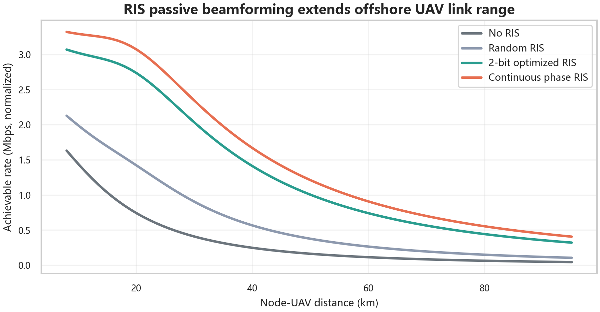
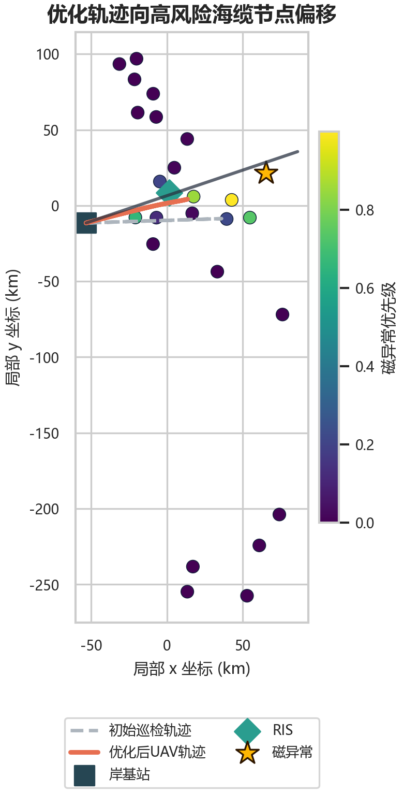
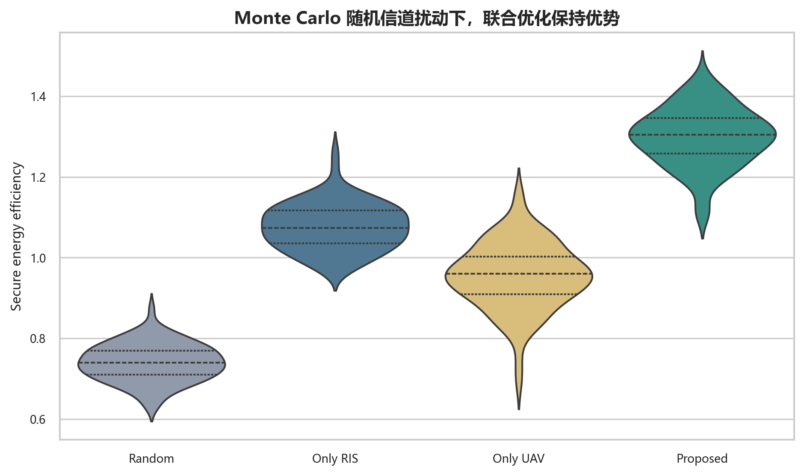

# Q-RIS-UAV Public Academic Report

**Quantum-key-protected RIS-UAV space-air-ground-sea integrated monitoring for offshore wind farms and submarine cables**

This repository contains the public, reproducible version of an academic final project on energy-efficient and secure data collection after offshore disasters. Private student identifiers have been removed from the public report; the cover keeps only:

- **Yanzhe Zhao**
- **Tianjin University, Future Technology College**

The prebuilt public slide deck is available at:

[Q-RIS-UAV-public-academic-report.pptx](report/Q-RIS-UAV-public-academic-report.pptx)

## Project Overview

The project studies a post-typhoon emergency monitoring scenario for offshore wind infrastructure and submarine cables. A UAV acts as a temporary aerial relay, a reconfigurable intelligent surface (RIS) improves weak offshore wireless links, quantum key distribution (QKD) constrains which critical data can be counted as secure, and magnetic anomaly sensing provides risk-aware priorities for submarine cable inspection.

The central optimization goal is to maximize **weighted secure data energy efficiency** under coupled constraints from UAV mobility, RIS phase quantization, wireless power and bandwidth, QKD key supply, and high-risk anomaly priorities.


## Technical Contributions

1. **Space-air-ground-sea integrated architecture**  
   The system connects satellite remote sensing and QKD, UAV relay communication, shore-side optimization and key management, offshore RIS-assisted propagation, and underwater magnetic anomaly sensing.

2. **Risk-aware secure energy-efficiency formulation**  
   Magnetic anomaly scores are mapped into task weights. Secure data is counted only when both wireless capacity and QKD key budget constraints are satisfied.

3. **Q-RIS-UAV-AO algorithm**  
   The mixed-integer, nonconvex, fractional optimization problem is decomposed using Dinkelbach transformation, alternating optimization, CVXPY-based convex resource allocation, RIS phase projection, and successive convex approximation for UAV trajectory updates.

4. **RIS/metasurface simulation evidence**  
   The project includes RIS link-gain comparisons, 1-bit/2-bit/3-bit phase quantization sensitivity, far-field beam steering, phase coding matrices, and unit phase-response curves.

## Scenario And Data

The public release combines open data with controlled simulation:

- **DeepOWT** offshore wind infrastructure coordinates for the offshore node scenario.
- **NOAA IBTrACS** tropical cyclone tracks for post-typhoon context.
- **Natural Earth** coastline data for map grounding.
- **NOAA WMM2025** geomagnetic model coefficients for magnetic background context.
- Synthetic wireless/RIS/UAV channels with fixed random seed for reproducible optimization experiments.



The large IBTrACS CSV is stored as `data/external/ibtracs.WP.list.v04r01.csv.zip` to stay below GitHub's single-file size limit. The run script automatically extracts it when needed.

## Optimization Model

The model jointly optimizes:

- UAV trajectory
- RIS phase matrix with 2-bit quantization
- Node scheduling
- Transmit power and bandwidth allocation
- Secure data volume
- QKD key allocation

The objective is a fractional secure energy-efficiency metric:

```text
maximize  weighted secure data / total system energy
```

The constraints include UAV speed and endpoints, power and bandwidth budgets, RIS discrete phase codebook, QKD key supply, minimum secure data requirements, and feasibility of node coverage.

## Algorithm Pipeline

The proposed **Q-RIS-UAV-AO** pipeline uses:

- **Dinkelbach transformation** for the fractional energy-efficiency objective.
- **Alternating optimization** for scheduling, resource allocation, RIS phase, and UAV trajectory.
- **CVXPY** for the convex power/key/secure-data allocation subproblem.
- **Phase alignment + 2-bit projection** for RIS control.
- **Successive convex approximation** for UAV trajectory updates.



## Key Results

RIS-assisted propagation improves weak offshore links, and 2-bit phase quantization preserves most of the continuous-phase gain.



The optimized UAV trajectory bends toward high-priority magnetic anomaly nodes while respecting mobility and energy constraints.



Robustness, ablation, and Pareto analysis show that RIS control, QKD-aware scheduling, and UAV trajectory adaptation provide complementary gains.



## Reproducibility

### Environment

Recommended environment:

- Windows PowerShell
- Python 3.12
- MATLAB R2024a for regenerating MATLAB RIS figures

MATLAB is optional for the public repository because the MATLAB-derived RIS PNG figures are already committed. If MATLAB is unavailable, the script reuses those committed figures.

### One-command reproduction

From the repository root:

```powershell
.\run_all_v2.ps1
```

The script will:

1. Create or reuse `.venv`.
2. Install Python dependencies from `requirements.txt`.
3. Extract the compressed IBTrACS CSV if needed.
4. Run the V2 simulation and optimization pipeline.
5. Regenerate MATLAB RIS figures when MATLAB is available.
6. Build the 77-slide public PPTX.
7. Run verification checks for data, figures, formulas, metrics, constraints, and slide count.

Expected generated report:

```text
outputs/ppt_v2/Q-RIS-UAV-public-academic-report.pptx
```

Expected verification summary:

```text
Verification V2 passed 15/15
```

## Repository Structure

```text
.
├── assets/gpt_image2/              # mechanism and architecture figures
├── data/                           # open data used by the scenario
│   ├── DeepOWT.geojson
│   ├── gt_2021Q2_ecs.geojson
│   ├── external/
│   │   ├── ibtracs.WP.list.v04r01.csv.zip
│   │   └── ne_10m_coastline/
│   └── wmm2025/WMM2025COF/
├── figures_v2/                     # committed preview figures and reusable chart assets
├── references/sources.md           # source anchors and data references
├── report/                         # public prebuilt slide deck
├── src/                            # simulation, deck generation, MATLAB RIS, verification
├── requirements.txt
└── run_all_v2.ps1
```

## Important Files

- `src/qris_uav_simulation.py`  
  Base scenario generation, wireless simulation, magnetic anomaly model, and baseline experiments.

- `src/qris_uav_simulation_v2.py`  
  Extended V2 experiments: IBTrACS/Natural Earth map, Dinkelbach-AO resource allocation, RIS sensitivity, Monte Carlo robustness, ablation, Pareto analysis, and constraint checks.

- `src/build_deck_v2.py`  
  Programmatic construction of the public 77-slide academic report.

- `src/ris_farfield_matlab.m`  
  MATLAB RIS phase coding, far-field beamforming, and unit phase-response plots.

- `src/verify_outputs_v2.py`  
  Reproducibility and artifact verification.

## Privacy And Public Release Notes

This public repository is sanitized. It is intended to contain only the public academic report, code, public/open data, generated figures, and reproducibility scripts. Private student identifiers are not included.

Before publication, the repository was scanned for private identifiers and only the public name and institution line were retained.
